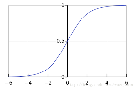

## 迴歸
* 最常用的回歸有兩大類:
    * 線性回歸
    * 非線性回歸所謂
## 線性迴歸
<pre>
線性回歸，就是在觀察和歸納樣本的過程中認為向量和最終的函數值呈現線性的關係而後設計這種關係為：
y=f(x)=wx+b
  這裡的w和x分別是1 x n和n x 1的矩陣，wb則指的是這兩個矩陣的內積具像一點說，
例如:你在一個實驗中觀察到一名病患的幾個指標呈現線性關係（如果你觀察到的不是線性關係而用線性模型來建模話，
會得到欠擬合的結果）拿到的
x是一個5維的向量，分別代表患者的：年齡、身高、體重、血壓、血脂這幾個指標值， 
y標籤是描述他們血糖程度的指標值， 
x和y都是觀測到的值。在拿到大量樣本（就是大量的後x和y），我猜測向量（年齡，身高，體重，血壓，血脂）和與其有關聯關係的血糖程度值有這樣的關係：

y=w1 ×年龄＋ w2 ×身高＋ w3 ×体重＋叫×血压＋ W5 ×血脂+b

這樣一來，在所有的患者數據輸入後，會出現一系列的六元次方程，也就是w矩陣的內容和偏置b的內容。

下面要做的事情就是要對 w矩陣的內容和偏置 b的內容求出一個最“合適”的解來。
這個“合適”的概念就是要得到一個全局範圍內由 f(x)映射得到的 y和我真實現測到的那個 y的差距加和，寫出來是這種 方式：
</pre>
$Loss = \sum_{i=0}^\n {wxi + b - yi}$
<pre>
怎麼理解這個 Loss 的含義呢？相當於做一個一個循環，i是循環變量，從1做到n，，覆蓋訓練集當中的每一個樣本向量加和的內容是wxi+b 和yi的差值，每一個訓練向量xi在通過我們剛剛假設的關係f(x)=wx+b映射後與實際觀測值yi的差距值。取絕對值的含義就是指這個差距不論是比觀測值大還是比觀測值小，都是一樣的差距將全局範圍內這n個差距值都加起來，得到所謂的總差距值，就是這個Loss 的含義。

</pre>
## 非線性迴歸
### 邏輯迴歸
* 範例
<pre>
假設我們的邏輯回歸模型具有學習了下列偏差和權重的三個特徵：
    •	b = 1
    •	w1 = 2
    •	w2 = -1
    •	w3 = 5
進一步假設給定樣本具有以下特徵值：
    •	x1 = 0
    •	x2 = 10
    •	x3 = 2
因此，對數幾率：
b+w1x1+w2x2+w3x3
將是：
  (1) + (2)(0) + (-1)(10) + (5)(2) = 1
因此，此特定樣本的邏輯回歸預測值將是 0.731：
y′=1/1+e−(1)=0.731
 
</pre>

#### 參考連結
* [机器学习](https://developers.google.com/machine-learning/crash-course/logistic-regression/calculating-a-probability?hl=zh-cn)
* [線性回歸](http://www1.pu.edu.tw/~hdchen/handout_bank/stat/94_4_stat_handout_08.pdf)
